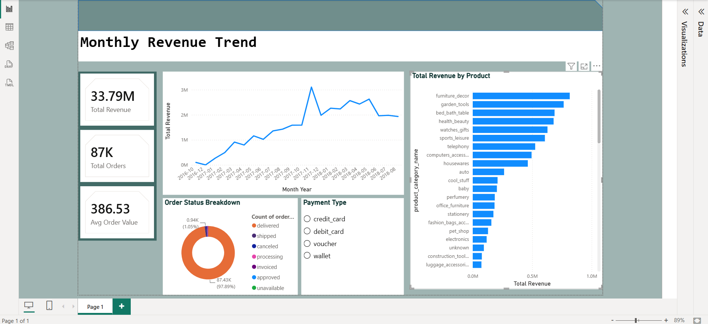

# E-Commerce Sales & Customer Intelligence Analytics

An end-to-end analytics project built on a real e-commerce dataset. It covers data cleaning, SQL analysis, exploratory data analysis, machine learning, an interactive Power BI dashboard, and an LLM-powered insights layer.

This project was built to show practical, job-ready analytics skills: investigating data quality issues, catching and fixing real bugs, making honest calls about what the data can and can't support, and documenting all of it clearly.



---

## Key Findings

- **$33.79M in total revenue** across 87,428 delivered orders, averaging **$386.53** per order.
- **One product category ("toys") makes up about 75% of all revenue.** This is a genuine, verified characteristic of this dataset, not a data error. It's handled explicitly throughout the analysis instead of being hidden.
- **92.3% of orders were delivered on time.** The small number of extreme delivery delays (44 orders over 100 days) were investigated and turned out to be isolated cases, not one systemic event.
- **Late delivery is hard to predict from order-level features.** A Random Forest model reached 74% accuracy but only 15% precision on the late class. The real drivers are probably logistics factors like carrier or distance, which aren't in this dataset. What the model did find: purchase month and customer state matter far more than price or payment method.
- **Every customer placed exactly one order.** This ruled out churn and CLV modeling and shaped the "customer intelligence" section around segmentation instead.

---

## Project Structure

```
├── data/
│   ├── raw/              # original Kaggle train/test CSVs, untouched
│   └── processed/        # cleaned, merged dataset ready for analysis
├── python/
│   ├── 01_data_cleaning.ipynb        # merging, null handling, exports
│   └── 02_exploratory_analysis.ipynb # trends, outlier investigation, correlations
├── sql/
│   ├── 01_database_setup.sql         # schema creation (orders + products)
│   ├── 02_data_quality.sql           # null checks, anomaly detection
│   ├── 03_sales_analysis.sql         # revenue, category, delivery, payment analysis
│   ├── 04_customer_analysis.sql      # spend segmentation, geography
│   └── 05_product_analysis.sql       # top/bottom products, pricing, shipping
├── ml/
│   ├── late_delivery_model.ipynb     # logistic regression + random forest
│   └── model_results.md              # honest results writeup
├── powerbi/
│   └── ecommerce_dashboard.pbix      # interactive dashboard
├── ai/
│   └── ai_insights.py                # Gemini-generated executive summary from live DB metrics
└── screenshots/
```

---

## The Dataset

Sourced from [Kaggle's E-Commerce Order Dataset](https://www.kaggle.com/datasets/bytadit/ecommerce-order-dataset), split into `train` and `test` folders, each with 5 CSVs (Customers, Orders, OrderItems, Payments, Products).

Before writing a single query, the data was inspected directly instead of assumed:

- The 5 files aren't independently-keyed relational tables. They're one denormalized table split by column group, row-aligned by `order_id`. `Products` was the one exception and needed deduplication before joining. An early merge attempt without deduplication caused a 40x row explosion, which was caught with a simple row-count check.
- `test` isn't a duplicate half of the same data. It's genuinely missing `order_status`, `order_delivered_timestamp`, and `order_estimated_delivery_date`, which means it was built for a real prediction task. `train` (89,316 orders) was used for all cleaning, SQL, EDA, and dashboard work. `test` was reserved for ML.
- Every customer placed exactly one order. This was confirmed, not assumed, and it directly shaped what kind of "customer intelligence" analysis was actually honest to build.

Full column-level documentation lives in [`data/data_dictionary.md`](data/data_dictionary.md).

---

## SQL Analysis

Five scripts against a PostgreSQL database with a proper `orders` / `products` schema, rebuilt intentionally since the source files weren't truly relational. Highlights:

- Reproduced every data quality finding from the Python cleaning step directly in SQL, plus a referential integrity check (0 orphaned `product_id` references).
- Revenue, category, payment, delivery, and geographic breakdowns, including a window function (`RANK() OVER PARTITION BY`) to find the top category per state.
- Customer segmentation by spend tier, since repeat-purchase analysis wasn't possible.

---

## Exploratory Data Analysis

Beyond re-visualizing the SQL findings, the EDA notebook investigates two things worth calling out.

**Delivery outliers.** A handful of orders took 150 to 200+ days to deliver. Instead of assuming a single systemic failure, the notebook tests that hypothesis directly by checking whether the delivery date those orders landed on was an unusually high-volume day. It wasn't (248 orders, compared to a normal range up to 415 per day). That ruled out a single-event explanation and pointed instead to isolated, individual delays.

**Correlation analysis.** Price shows almost no linear correlation with shipping cost, payment behavior, or product dimensions (all under 0.03). This finding ruled out price prediction as a good ML task before any model was built.

---

## Machine Learning

**Task:** predict whether an order will be delivered late, using features known at the time of purchase (price, payment info, category, state, purchase timing).

**Result:** Random Forest reached 74% accuracy but only 15% precision on the late class. That's a modest result and it's reported honestly rather than inflated. The more interesting finding was in feature importance: purchase month mattered roughly twice as much as any other feature, which lines up with the November revenue spike found in the EDA. Busier months likely strain delivery capacity. Customer state was the next most important factor. Price and payment method barely mattered.

Full writeup: [`ml/model_results.md`](ml/model_results.md)

---

## Power BI Dashboard

An interactive single-page dashboard with a KPI summary, monthly revenue trend, category revenue breakdown, order status breakdown, and a payment-type slicer that cross-filters the whole page.

"Toys" is excluded from the category chart specifically, since including it visually flattens every other category into an unreadable line. That was a deliberate design choice made after testing, not an oversight.

---

## AI/LLM Integration

`ai/ai_insights.py` connects to the PostgreSQL database, pulls the same core metrics validated throughout the SQL analysis, and sends them to Google's Gemini API to generate a short natural-language executive summary. The prompt tells the model to use only the provided numbers. The LLM's job here is communication, not analysis. Every figure it summarizes has already been independently verified in SQL and Python.

---

## Running This Project

**Requirements:** Python 3, PostgreSQL, Power BI Desktop (Windows), a free Gemini API key.

```bash
# Python environment
pip3 install pandas matplotlib seaborn scikit-learn psycopg2-binary google-genai python-dotenv

# Database setup
createdb ecommerce_analytics
psql -d ecommerce_analytics -f sql/01_database_setup.sql
psql -d ecommerce_analytics -c "\copy products FROM 'data/processed/products.csv' WITH (FORMAT csv, HEADER true);"
psql -d ecommerce_analytics -c "\copy orders FROM 'data/processed/orders.csv' WITH (FORMAT csv, HEADER true);"

# AI insights (requires a .env file with GEMINI_API_KEY=your_key)
python3 ai/ai_insights.py
```

The Power BI dashboard (`powerbi/ecommerce_dashboard.pbix`) can be opened directly in Power BI Desktop. It reads from `data/processed/master_cleaned.csv`.

---

## Author

Built by [dparth22](https://github.com/dparth22) as a portfolio project demonstrating the full analytics stack: SQL, Python, data cleaning, EDA, machine learning, BI dashboarding, and LLM integration.
